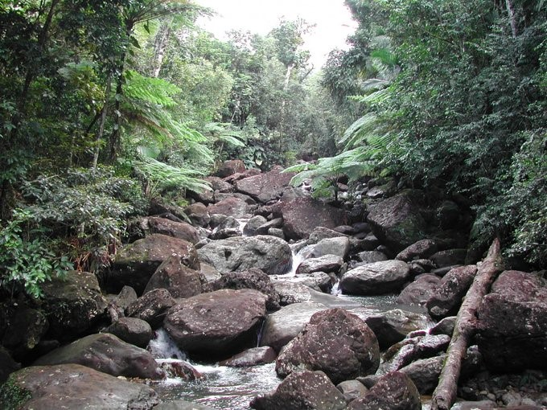

# Team: PR

## EDS 214 Group Project

Source: Luquillo LTER

Quebrada Sonadora

## Overall Goal

The goal of this project was to work as a team using an analytical workflow. In order to do this we utilized data collected on stream water chemistry within the Luquillo Experimental Forest, this data was collected as part of the the long Term Ecological Research (LTER) Network.

### Additional Goals

### Recreate a graph

The first object of the project was to recreate a graph containing data on potassium and nitrogen between 1988 and 1994 for three sites within the Loquillo Experimental Forest. These sites were Puente Roto Mamayes, Quebrada 1-Bisley, Quebrada 2- Bisley and Quebrada 3- Bisley.

### Devising our own question

The second goal of the project was to devise our own question around the data. We were interested in looking at the relationship between suspended sediment and pH at the same three sites from 1986 to 2018.

## Running the Code

The data used in this project is located on EDI and can be accessed here: <https://portal.edirepository.org/nis/mapbrowse?packageid=knb-lter-luq.20.4923058>

## Acknowledgements

Collaborators: Andre Dextre, Alessandra Vidal Meza, Guillermo Romero, Adelaide Robinson

## References

Baugh, K. The Effect of Hurricanes on the Monthly Anomalies of pH and Dissolved Inorganic Carbon at the Bermuda Atlantic Time-series Study site. Office of Citizen Scholar Development: Undergraduate Research. https://undergraduateresearch.virginia.edu/effect-hurricanes-monthly-anomalies-ph-and-dissolved-inorganic-carbon-bermuda-atlantic-time-series-0

McDowell, W. 2022. Chemistry of stream water from the Luquillo Mountains ver 4923058. Environmental Data Initiative. hhtps:/doi.org/10.6073/pasta/1dd1a59a7e6fbe95fdf8736477d81b83

Schaefer, D., McDowell, W., Scatena, F., & Asbury, C. (2000). Effects of hurricane disturbance on stream water concentrations and fluxes in eight tropical forest watersheds of the Luquillo Experimental Forest, Puerto Rico. Journal of Tropical Ecology, 16(2), 189-207. doi.org/10.1017/S0266467400001358\>

Sha Lou, Wenrui Huang, Shuguang Liu, Guihui Zhong, Elijah Johnson, Hurricane impacts on turbidity and sediment in the Rookery Bay National Estuarine Research Reserve, Florida, USA,International Journal of Sediment Research,Volume 31, Issue 4, 2016,ISSN 1001-6279. doi.org/10.1016/j.ijsrc.2016.06.006.
